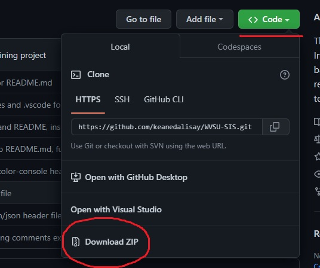
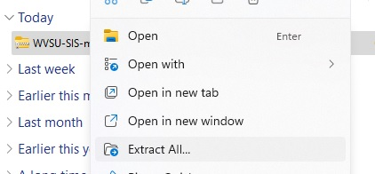
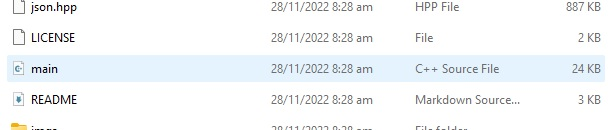
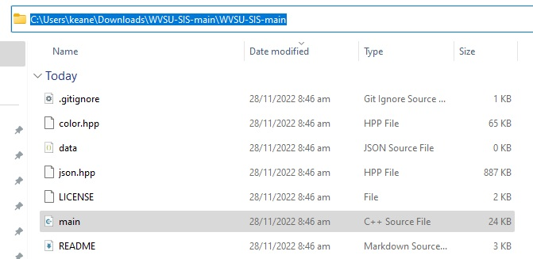
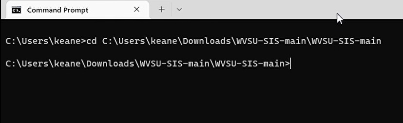
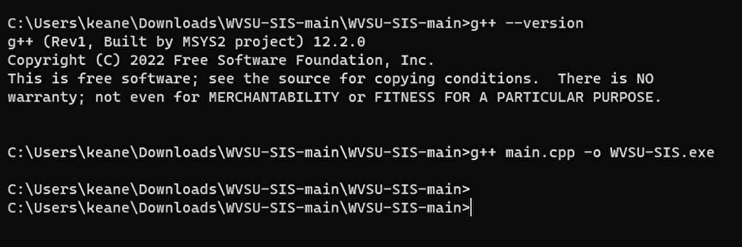
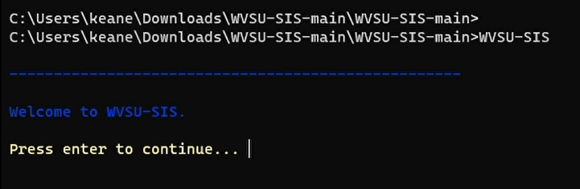
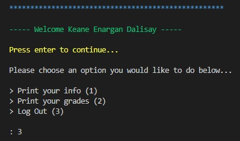
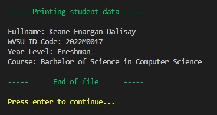
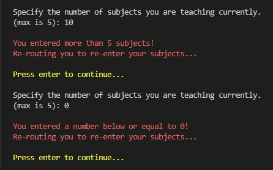

# WVSU-SIS

The West Visayas State University Student Information System (WVSU-SIS) is a C++ based program designed to store, retrieve, and print student as well as teacher info.

This program was made as a final project for our subject CC 202 (Computer Programming 1).

## Installation





Then open the `main.cpp` file, compile, and run it through your designated IDE or code editor like **Dev C++**, **Code::Blocks**, **Visual Studio** or **Visual Studio Code**.

If you want to run it through **Command Prompt** or **PowerShell**, follow the guide below:

1. Copy folder path to `main.cpp`.



2. Type `cd` in command line, add space, paste path and press `Enter`.



3. Type `g++`, space, the file name `main.cpp`, space, `-o`, space, and the name of the executable `WVSU-SIS.exe`. You can name the executable anything you want. Note you must have **g++ compiler** installed for this to work.



4. Run the executable file by typing its name, like `WVSU-SIS`. Note your executable may have a different name so check it in the folder it is in.



That's it, WVSU-SIS now runs on your terminal!

If it asks you for a `.json` file, type in `data.json`. You can modify the file name on the folder you extracted WVSU-SIS.

---

## Contributors

<a href="https://github.com/ObnoxiousCoder"></a>

---

## Features

- [Persistent Storage with JSON](#persistent-storage-with-json)
- [Sign-up, Log in & Out](#sign-up-log-in--out)
- [Outputting Text with Color](#outputting-text-with-color)

## Persistent Storage with JSON

To handle JSON manipulation, we decided to use a library called [nlohmann/json](https://github.com/nlohmann/json).

With it, you can parse strings to JSON and the opposite. Those strings are then sent to a `.json` file for safe keeping.

It is best if you do not interfere with the file (e.g. add content or modify it), as you would risk breaking the functions built around sending that data to that file.

Below is one of those functions, this one fetches data from the file. All JSON related functions are stored in the `jsonManip` namespace.

```cpp
namespace jsonManip
{
    using json = nlohmann::ordered_json;
    using std::string;

    void getData(json &data, string fileName)
    {
        std::ifstream jsonInpFile(fileName);

        if (help::isNotEmptyFile(jsonInpFile))
        {
            jsonInpFile >> data;
        }
        jsonInpFile.close();
        return;
    }
```

## Sign-up, Log-in & Out

WVSU-SIS lets you sign-up as a new user (either a student or teacher) and log-in or out of the program.

You would be then routed to a dashboard, where you are free to choose any of the options presented as seen in the image below:



The first option, lets the program print the info you inputted when you first signed-up as a new user:



## Outputting Text with Color

Outputting text on all white can sometimes be bland, everything's the same. You don't get to differentiate what text is important or not.

That is why we decided to include colors to some text with the [aafulei/color-console](https://github.com/aafulei/color-console) library.



## License

Copyright (c) 2022 Keane Dalisay

The content of this depository is licensed under [MIT](LICENSE)
